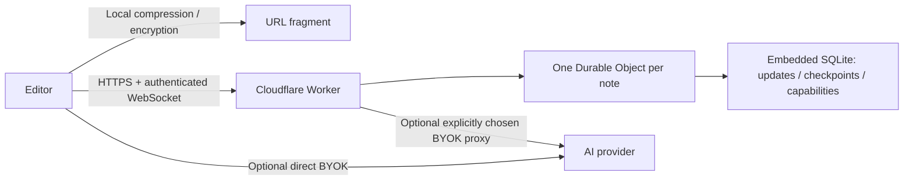

# QuickJot: persistent notes, collaboration and BYOK exploration

Status: design exploration, not a deployed service. Existing self-contained notes remain the default. Prices checked against official documentation on 2026-09-16.

## Recommended product model

Use two document modes and make AI an independent optional tool available in either mode.

| | Link snapshot | Live note |
| --- | --- | --- |
| Where it lives | Compressed URL fragment | Cloudflare room storage |
| Sharing | A fixed copy of the note | A stable link to the latest document |
| Editing | A new link for each version | Changes sync to the same room |
| Offline | Fully local | Cached draft, queued edits, explicit sync status |
| Collaboration | Make your own copy | Multiple editors and presence |
| Privacy | Existing optional password encryption | Host can read content in the first release |
| Cost to host | Static assets | Room requests, storage and active compute |

Keep the initial canvas as it is: no mode picker blocking writing. A small “Link snapshot” badge next to the title opens document storage options. “Make this a live note” explains the change, expiry and server storage before conversion. Creation must successfully persist the document before changing its URL. Failed creation leaves the original snapshot intact.

Share offers “Snapshot link” in both modes. Live notes additionally offer “View live note” and “Invite to edit”, with different capability links and a permission label beside each copy action. Do not label a mutable live link as a snapshot. Opening a viewer link should expose “Make a copy”, not a misleading edit button. Viewer status is enforced by the server; the existing `?view=read` parameter is only presentation, not an authorization mechanism.

The sidebar remains part of the background, closed by default and locally remembered. Use it for outline and recent notes. The document header has storage mode, sync status, collaborators, AI and Share. Put provider settings inside the AI panel and note ownership/expiry inside storage settings. On mobile, use sheets rather than simultaneously shrinking the editor with several panels.

## Do we need a server?

Self-contained notes need none. Direct BYOK requests can remain frontend-only when a provider supports browser requests, but browser keys are available to scripts on the page. Anthropic explicitly disables browser SDK use by default and requires an opt-in. Verify CORS and browser support independently for every provider. [Anthropic SDK](https://github.com/anthropics/anthropic-sdk-typescript#requirements).

Stable persistent links need storage. Reliable live collaboration needs a shared synchronization service; peer-to-peer connections still need discovery and may need relays. Recommend a small Cloudflare Worker and one SQLite-backed Durable Object per live note. This is a serverless backend, without operating a long-running server or Redis.

## Cloudflare architecture

Serve the Vite build with Workers Static Assets. Only API routes invoke the Worker. No D1 is required for the first version: room data is already in the Durable Object. Add D1 later if account-based libraries or indexed search across notes become requirements. A local recent-note list remains sufficient for anonymous use.

Use Yjs with Tiptap Collaboration and a WebSocket provider. Disable StarterKit undo/redo in live mode so Yjs owns collaborative undo; local snapshot mode keeps existing undo. Store the title in a shared Y.Map and body in a Y.XmlFragment. Presence is transient awareness data, never document history. Pick one canonical Yjs document when converting a snapshot; reconnects must not seed the same JSON again.

The room uses Cloudflare's WebSocket Hibernation API. Restore document state when the object wakes and socket authorization from serialized attachments. Authenticate a message before applying it. Bound binary frame size and decoded document size. Implement the Yjs sync protocol, rather than simply broadcasting JSON replacements. Persist accepted updates before acknowledging durable save; “Connected” and “Saved” are separate states. Hibernation must reconstruct from durable storage, not assume an in-memory Y.Doc survives. [Cloudflare WebSockets guidance](https://developers.cloudflare.com/durable-objects/best-practices/websockets/).

Append updates durably, compact to a checkpoint after a bounded number or size of updates, and retain a bounded recent recovery window. Do not use a permanent interval for compaction or presence heartbeats: it can keep the room awake. Merge small client updates within a brief bounded batch; persist before acknowledgment. Exact batch size is a benchmark decision, not a reason to silently lose acknowledged edits.

Add IndexedDB for live-note drafts and pending Yjs changes. Reconnect with exponential backoff and show “Offline · changes on this device”. Room expiry or revoked permissions stops automatic publishing and offers download or a new snapshot. Never discard pending changes because a remote fetch fails.

## Links and ownership

Use an opaque random room ID in `/n/:roomId` and independent cryptographically random capability tokens. Store token hashes, roles and a revocation generation in the room. A viewer token cannot update the title/body or invite others. An owner token can rotate editor/viewer links, set expiry and delete the note. Editor links cannot delete or change access.

Keep capabilities in the fragment, not a query string. Fetch the room with an Authorization header. For WebSockets, authenticate the initial application message before any document state is sent; reject unauthenticated sockets quickly. Validate Origin, roles and message types. Never put provider keys or capabilities in request logs. Use `Referrer-Policy: no-referrer` and `Cache-Control: no-store` for room responses.

Anonymous ownership is possession of the owner capability. Explain that losing the owner link means losing management access; offer “Save owner link” separately from sharing. Store it locally only with explicit UX clarity. Shared editing links intentionally give access to everyone holding that link. Account recovery and named-user permissions are a later feature, not something random IDs provide.

Proposed API contract:

| Endpoint | Capability | Behavior |
| --- | --- | --- |
| `POST /api/notes` | Creation controls | Validate and store initial Yjs state; return room and capabilities once |
| `GET /api/notes/:id` | Viewer/editor/owner | Return metadata, checkpoint and expiry |
| `GET /api/notes/:id/ws` | Authenticate first message | Role-checked sync and awareness |
| `POST /api/notes/:id/access` | Owner | Rotate invitation capabilities and disconnect revoked sessions |
| `DELETE /api/notes/:id` | Owner | Remove stored content and disconnect all sessions |

These are proposed endpoints, not implemented APIs. Protect room creation with per-IP limits, a global budget and an optional Turnstile challenge when abuse appears. Enforce room limits server-side (suggested starting limits: 20 connected clients, 1 MiB document, 64 KiB updates). Numbers are launch policy proposals and need realistic document benchmarks.

Password-protected snapshots remain encrypted. Do not silently turn one into an unencrypted live note. Offer an explicit “Upload unlocked copy” flow with a clear statement that the host can read it. End-to-end encrypted Yjs synchronization requires a separate protocol/key-sharing design; defer that until it can be audited. UI labels must not imply live notes inherit snapshot encryption.

## BYOK editing UX

The AI button opens a right-side panel on desktop and a sheet on mobile. First use shows provider, model, key and connection mode. Keep keys in memory by default, outside note JSON, URLs, local history and Yjs. If “Remember on this device” is added, make it explicit that browser storage is not a secret vault. Never share keys between collaborators.

Start with one tested provider adapter and allow manual model selection; do not hard-code “latest” model promises. Direct mode sends the key and selected text only to that provider. Proxy mode sends them through the app backend too, disclosed before use. The proxy must only allow predefined HTTPS provider endpoints, never arbitrary user URLs or redirects carrying credentials. Do not persist credentials or prompts, log request bodies, or introduce a host-funded AI key.

Actions: Improve writing, shorten, expand, fix grammar, translate, summarize and custom instruction. Default context is the selection. “Use whole note” is an explicit switch with the amount of text shown. Generation has a cancellable preview, retry and provider error states. No automatic AI request when opening a note or selecting text.

Keep the current document untouched while streaming. Render generated content as sanitized Markdown using the editor schema, never raw trusted HTML. Offer “Replace selection”, “Insert below” and “Copy”. One accepted result creates one undoable editor transaction. Capture the target selection and its original content when starting a request. If it changes before acceptance, require reselection or insert the proposal elsewhere rather than replacing unrelated text. In collaborative mode, use Yjs relative positions plus a content check; numeric positions alone are unsafe during remote edits.

The AI panel is personal and transient. Only accepted edits sync to collaborators. Viewer links can generate/copy a suggestion but cannot apply it to a live note. Collaborators see accepted edits as normal shared changes; document history can record that they originated from an AI proposal without recording the private prompt or API key.

Suggested provider-neutral adapter: `generate({ model, key, instruction, context, signal })` yields text chunks and usage when provided. Cap context and output, handle 401/429/network failures, expose cancellation and clear keys on disconnect. Avoid storing chat transcripts by default. Prompt templates must treat note text as quoted source content, not as instructions to call tools.

## Cost and operational boundaries

Workers Static Assets requests are free and unlimited. Workers Free includes 100,000 dynamic requests/day; the paid subscription starts at $5/month, with usage charges above included allocations. [Workers pricing](https://developers.cloudflare.com/workers/platform/pricing/).

SQLite Durable Objects are available on Free. Included limits are 100,000 compute requests/day, 13,000 GB-s/day, 5 million row reads/day, 100,000 row writes/day and 5 GB storage. Incoming WebSocket messages have a 20:1 billing ratio; outgoing messages are uncharged. Hibernation avoids idle duration charges. Free-limit excess fails operations. [Durable Objects pricing](https://developers.cloudflare.com/durable-objects/platform/pricing/).

Inference: a small personal beta may fit Free, but writing-heavy collaboration can exhaust daily row writes before storage. Budget from measured workloads, not connection count alone. A possible launch policy is 30-day expiry for anonymous live notes, shown at creation and in the header; extension requires an owner action. Do not promise permanent storage while silently expiring notes. BYOK means model usage is charged to each user's provider account; AI proxy compute still belongs to the host.

Track active room time, accepted update count/bytes, rows written, storage growth and failures without recording content. Start on Free with hard limits; consider Paid only after measurement. Feature flags let the host disable new room creation and proxy requests while keeping existing notes readable and exports available. No deployment or paid service should be required to run snapshot mode.

## Implementation order and completion criteria

1. Storage-mode UI and persistent single-user rooms. Test failed conversion, owner/viewer separation, rotated links, expiry, deletion and export. Keep snapshots working without backend configuration.
2. Yjs live editing and presence. Test simultaneous offline edits, reconnect, object eviction/wake, two clients editing title/body, role revocation, oversized input, and collaborative undo.
3. BYOK preview/apply flow. Test key isolation, no implicit transmission, canceled streams, malformed output and stale selections during remote edits.
4. Recovery: offline outbox, bounded revisions, “Make a snapshot” and migration between modes. Never present local-only changes as server-saved.
5. Finish keyboard/mobile/accessibility flows, error messages, reduced-motion behavior and documentation of privacy/cost limits.

Other useful additions after the core is reliable: find/replace, tables, links/backlinks within a local library, pinned notes, templates, revision restore and optional comments. Math blocks can fit the existing slash menu. Defer attachments, public indexing and account/workspace management: they add storage/abuse/access-control work and should not crowd the simple writing experience.
